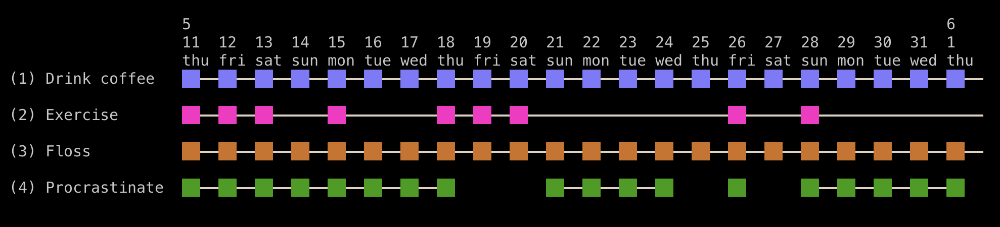

# Habu

Habu is a TUI habit tracker inspired by [Taskwarrior](https://taskwarrior.org/) and [Timewarrior](https://timewarrior.net/).

It's inspired by the "Don't break the chain" method (attributed to Jerry Seinfeld) that encourages forming habits by performing the task every day and eventually building up a long "chain" of consecutive days. Seeing the chain grow over time is a powerful reminder of your progress and motivates sticking to it: don't break the chain!

<p align="center">
  
</p>

## Installation

Grab the latest build from the [releases](https://github.com/schmee/habu/releases/), or [build it yourself](#building)!

## Building

Habu is primarily tested on macOS, but Linux is also supported (there is no Windows support yet).

1. Download Zig 0.11.0 for your platform from https://ziglang.org/download/.
1. Clone this repo.
1. Run `zig build install -Drelease`.
1. Place `zig-out/bin/habu` somewhere on your path.

## Note on stability

Although Habu is stable enough for daily use, it should still be considered experimental. It is recommended to regularly back up your `.habu` directory, especially before upgrading to a new version.

The versioning philosophy is to avoid breaking changes whenever possible, for both the data format and the CLI, but there might be cases where breaking changes are necessary. If they do occur, they will be always be pointed out explicitly in the CHANGELOG and include instructions on how to upgrade.

## Getting started

 Let's walk through how to track a daily habit:

1. Add a chain with `habu add`:
  - To add a daily habit, use `habu add <name> daily`
  - To add a weekly habit, use `habu add <name> weekly <days per week>`
    - The last number sets how many days per week the habit must be performed to be considered unbroken

After adding a chain, all your chains are displayed on a calender-like grid. This grid can be viewed with either `habu display` or just `habu` without arguments. The number before the chain name is the _chain index_, which is used in most commands to refer to a specific chain.

```
                                                                           8
               17  18  19  20  21  22  23  24  25  26  27  28  29  30  31  1
               mon tue wed thu fri sat sun mon tue wed thu fri sat sun mon tue
 (1) Exercise
  ^--- this is the chain index
```


2. To mark today's exercise as completed, use `habu link 1`:

```
                                                                           8
               17  18  19  20  21  22  23  24  25  26  27  28  29  30  31  1
               mon tue wed thu fri sat sun mon tue wed thu fri sat sun mon tue
 (1) Exercise                                                              ██
                                                        link added --------^^
```

3. Let's mark yesterday as well with `habu link 1 yesterday` (`habu link 1 y` for short):

```
                                                                           8
               17  18  19  20  21  22  23  24  25  26  27  28  29  30  31  1
               mon tue wed thu fri sat sun mon tue wed thu fri sat sun mon tue
 (1) Exercise                                                          ██━━██
                                           building up the chain! -------^^
```

That's it! You can use `habu help` to list the available commands and some additional explanation of the basic concepts.

Tracking your habits in this way is a means to an end: the goal is not to add a tick in the "Exercise" or "Writing" chains, it is to get in better shape and write the book you've always dreamed about. I've found that tracking my habits in this way helps me avoid procrastinating and stay focused on the things that really matter to me, but I certainly don't expect it to appeal to or work for everyone. Experiment and see what works best for you!

